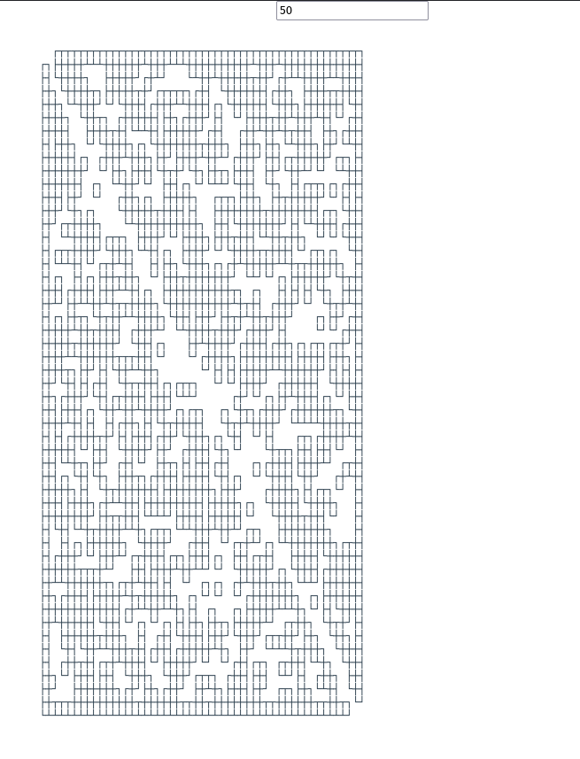
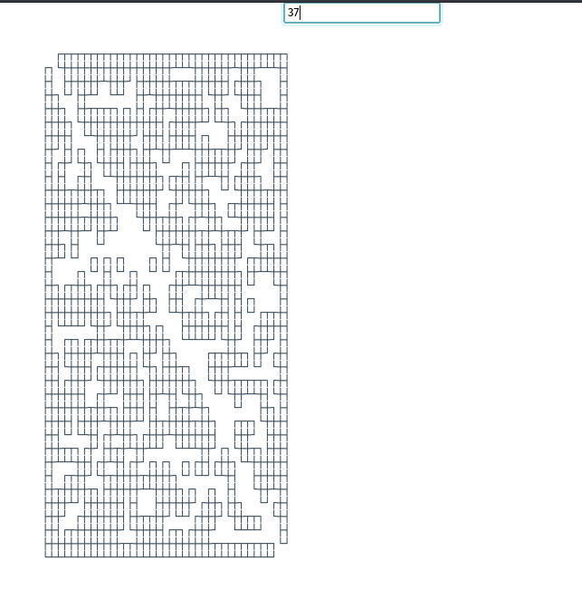
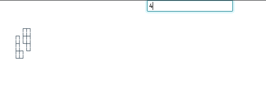
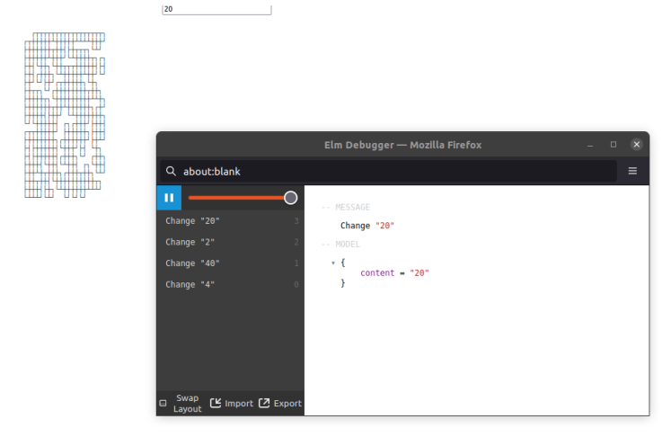

# Labirinto

**Disciplina**: FGA0210 - PARADIGMAS DE PROGRAMAÇÃO - T01  
**Número do Grupo**: 04 
**Paradigma**: Funcional 
**Liguagem**: Elm

## Membros

| Foto | Matrícula | Nome | GitHub |
|:--:|:--:|:--:|:--:|
| | 15/0005563 | Andre Lucas Ferreira Lemos de Souza | [@andrelucasf](https://github.com/andrelucasf) 
| | 18/0030272 | Antonio Ruan Moura Barreto | [@RuanMoura](https://github.com/RuanMoura) 
| | 18/0041444 | Brenda Vitória dos Santos | [@brendavsantos](https://github.com/brendavsantos)
| | 18/0052616 | Estevão de Jesus Reis | [@estevaoreis25](https://github.com/estevaoreis25)
| | 18/0033743 | Joao Pedro Silva de Carvalho | [@jps12](https://github.com/jps12) 
| | 18/0037439 | Sérgio de Almeida Cipriano Junior | [@sergiosacj](https://github.com/sergiosacj) 
| | 18/0028324 | Thiago Luiz de Souza Gomes| [@thiagomesUNB](https://github.com/thiagomesUNB) 
| | 18/0028685 | Victor Samuel dos Santos Lucas| [@victordsantoss](https://github.com/victordsantoss) 
| | 17/0115500 | Vinicius Vieira de Souza | [@faco400](https://github.com/faco400) 

## Sobre 
Esse projeto consiste em um jogo de Labirinto disponível em plataforma Web, desenvolvido em linguagem funcional (Elm), que visa aplicar algoritmos de grafo para gerar e solucionar labirintos.

## Screenshots

### Tela Inicial

Simulação da geração do labirinto com um tamanho 50 linhas e 50 colunas.

 

Simulação da geração do labirinto com um tamanho 37 linhas e 37 colunas.

 

Simulação da geração do labirinto com um tamanho 4 linhas e 4 colunas.

 

### Debug

Screenshot e Tela de Debug disponibilizada pela linguagem Elm.

 

## Instalação 
### Linguagens: Elm - 0.19.1
### Compilação: 
> Caso você queira compilar o projeto do zero, basta executar:

    $ docker-compose up --build
> Assim, você gera o arquivo "index.html":

    Agora é só abrir esse arquivo em qualquer navegador.

### Uso 
> Após a execução do comando docker mostrado acima, basta abrir a porta apontada pelo projeto no navegador:

    http://localhost:3000/

> E em seguida digitar no campo apresentado na tela o tamanho do labirinto que deseja gerar.

    ex: 25

## Vídeo 
### Youtube: https://www.youtube.com/embed/oeKhZCkFu2s